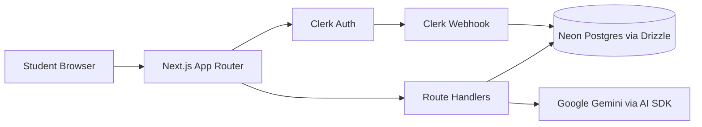

# EduBridge AI

AI-powered study abroad advisor that helps students discover university and scholarship opportunities, generate personalized match results, and chat with an admissions assistant.

## Table of Contents

- [Overview](#overview)
- [Current Features](#current-features)
- [Tech Stack](#tech-stack)
- [Architecture](#architecture)
- [Route Map](#route-map)
- [Database Model](#database-model)
- [Local Development](#local-development)
- [Environment Variables](#environment-variables)
- [Database and Seeding Workflow](#database-and-seeding-workflow)
- [Scripts](#scripts)
- [Deployment Notes](#deployment-notes)
- [Troubleshooting](#troubleshooting)
- [Known Gaps / In Progress](#known-gaps--in-progress)

## Overview

EduBridge AI is built for international students who need practical, affordable guidance for U.S. admissions.

Core flow:

1. Student signs in with Clerk.
2. Student completes profile data (academic, financial, language, preferences).
3. System ranks universities and scholarships using deterministic scoring.
4. Gemini generates concise explanations, strengths, improvements, and roadmap tasks.
5. Student reviews results in dashboard and can chat with the AI advisor using those results as context.

## Current Features

- Public marketing landing page.
- Clerk-based authentication (`/sign-in`, `/sign-up`).
- Protected dashboard with sections:
	- Overview (`/dashboard?section=dashboard`)
	- Profile (`/dashboard?section=profile`)
	- Universities (`/dashboard?section=universities`)
	- Scholarships (`/dashboard?section=scholarships`)
- Profile completion form with server-side validation and DB persistence.
- AI match generation endpoint with result reuse and optional force regeneration.
- Dashboard chat endpoint grounded in latest match output.
- Clerk webhook endpoint that syncs users to Neon Postgres.

## Tech Stack

- Framework: Next.js 16 (App Router)
- Runtime: React 19 + TypeScript
- Styling/UI: Tailwind CSS v4 + shadcn/ui + Radix primitives
- Auth: Clerk (`@clerk/nextjs`)
- Database: Neon Postgres (`@neondatabase/serverless`)
- ORM/Migrations: Drizzle ORM + Drizzle Kit
- AI: Vercel AI SDK + Google Gemini (`@ai-sdk/google`)
- Validation: Zod + React Hook Form

## Architecture



Security model:

- `proxy.ts` protects all non-public pages and API routes.
- Public routes: `/`, `/sign-in(.*)`, `/sign-up(.*)`, `/api/webhook/clerk(.*)`.
- Dashboard and API handlers enforce authenticated access with `auth()`.

## Route Map

Pages:

- `/` - Landing page.
- `/sign-in` - Clerk sign-in experience.
- `/sign-up` - Clerk sign-up experience.
- `/dashboard` - Main student workspace with query-based section switching.
- `/admin` - Placeholder admin page (currently minimal).

API routes:

- `GET /api/profile-completion` - Load current user profile + completion percentage.
- `POST /api/profile-completion` - Upsert profile values.
- `GET /api/dashboard/match-results` - Check if AI match results exist and fetch latest.
- `POST /api/dashboard/match-results` - Generate (or reuse) AI match results.
- `GET /api/dashboard/chat` - Load chat history.
- `POST /api/dashboard/chat` - Send user message and receive AI response.
- `GET /api/dashboard/universities` - List universities (cached server-side).
- `GET /api/dashboard/scholarships` - List scholarships (cached server-side).
- `POST /api/webhook/clerk` - Clerk user sync webhook.

## Database Model

Main tables in `db/schema.ts`:

- `users`
- `student_profiles`
- `universities`
- `scholarships`
- `match_results`
- `chat_messages`

Migrations are stored in `drizzle/`.

## Local Development

### Prerequisites

- Node.js 18.18+ (Node 20+ recommended)
- npm
- Clerk application
- Neon Postgres database
- Google AI Studio API key (Gemini)

### Setup

1. Install dependencies:

```bash
npm install
```

2. Create `.env.local` in project root and add required variables (see next section).

3. Apply database migrations:

```bash
npx drizzle-kit migrate
```

4. Seed sample universities and scholarships (optional but recommended for dashboard testing):

```bash
npx tsx db/seed.ts
```

5. Start the app:

```bash
npm run dev
```

6. Open `http://localhost:3000`.

## Environment Variables

Create `.env.local`:

```bash
# Neon / Postgres
DATABASE_URL=

# Clerk
NEXT_PUBLIC_CLERK_PUBLISHABLE_KEY=
CLERK_SECRET_KEY=
CLERK_WEBHOOK_SIGNING_SECRET=

# Gemini (either variable is accepted by the app)
GEMINI_API_KEY=
# OR
GOOGLE_GENERATIVE_AI_API_KEY=

# Optional (safe-guard override for non-dev seed runs)
ALLOW_DB_SEED=false
```

Notes:

- `DATABASE_URL` is required by Drizzle config and DB client.
- Match and chat endpoints require one Gemini API key.
- Clerk webhook verification expects Clerk webhook signing secret.

## Database and Seeding Workflow

### Migrations

- Generate migration from schema changes:

```bash
npx drizzle-kit generate
```

- Apply migrations:

```bash
npx drizzle-kit migrate
```

### Seed data

Seeding script (`db/seed.ts`) is intentionally destructive (clears existing app data before insert).

Safety behavior:

- Allowed in development (`NODE_ENV=development`), or
- Allowed when `ALLOW_DB_SEED=true`, or
- Allowed with `--force` CLI argument.

Example force run:

```bash
npx tsx db/seed.ts --force
```

## Scripts

- `npm run dev` - Start Next.js dev server.
- `npm run build` - Create production build.
- `npm run start` - Run production server.
- `npm run lint` - Run ESLint.

## Deployment Notes

- Recommended host: Vercel.
- Configure all environment variables in deployment settings.
- Ensure Clerk instance URLs/keys match deployment domains.
- Ensure Neon production DB URL is used in production environment.

For Clerk webhooks in deployed environments:

- Point webhook endpoint to `/api/webhook/clerk`.
- Subscribe at minimum to `user.created`, `user.updated`, and `user.deleted`.

## Troubleshooting

### "Gemini API key is missing"

Set either `GEMINI_API_KEY` or `GOOGLE_GENERATIVE_AI_API_KEY` in `.env.local`.

### "User record not found"

The app requires user rows in `users` table. Confirm Clerk webhook delivery to `/api/webhook/clerk`.

### Dashboard shows no matches

- Complete profile first via `My Profile` section.
- Make sure seeded `universities` and `scholarships` data exists.

### ngrok dev tunnel and broken Next.js dev assets

If you expose local dev through ngrok and see missing `/_next/*` assets or dead interactivity, add tunnel origin to `allowedDevOrigins` in `next.config.ts` and restart dev server.

## Known Gaps / In Progress

- `/admin` page is currently a placeholder UI.
- Role-based admin authorization is not yet fully implemented in route logic.
- Automated tests are not yet included in this repository.

